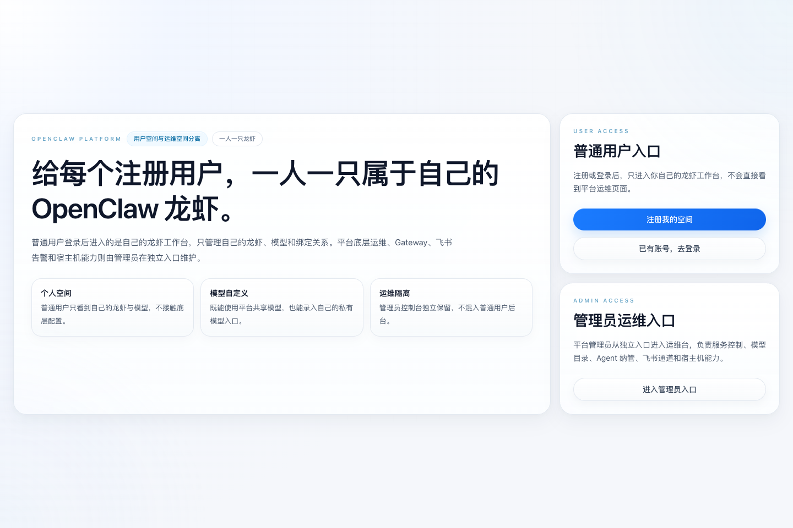
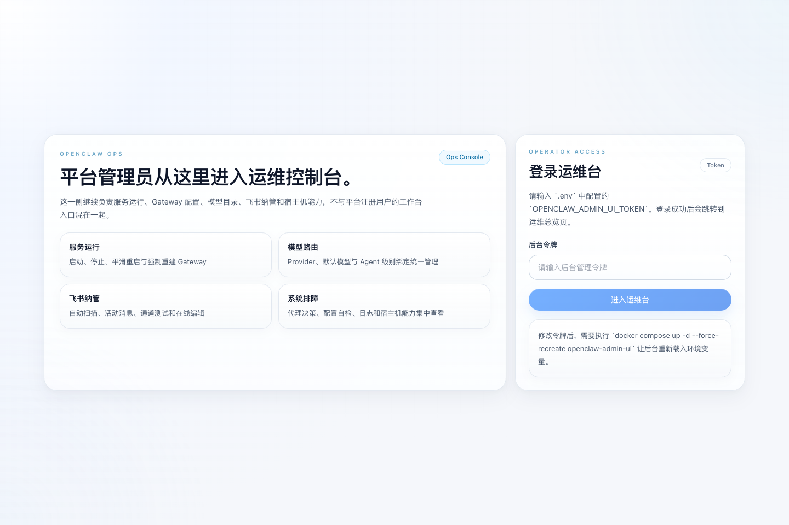
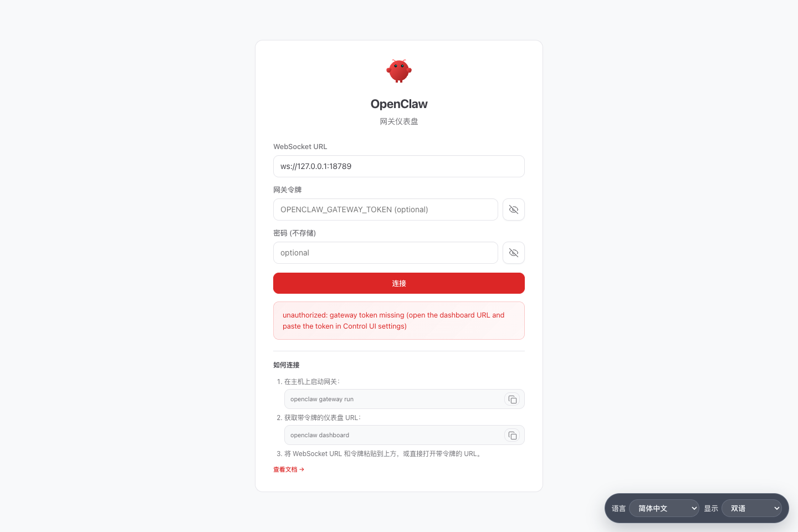

# OpenClaw Docker

<p align="center">
  
</p>

<p align="center">
  <a href="./LICENSE"></a>
  
  
  
  
</p>

> 想把 `OpenClaw` 稳定跑在自己电脑或局域网里，但又不想被 `Docker`、配置文件、数据目录、后台运维和各种奇怪问题反复折腾？
>
> 这个项目就是为这件事准备的：它不是 `OpenClaw` 核心源码，而是一套**更适合真实落地**的本地部署与运维方案。
>
> 你可以把它理解成：**帮你把 OpenClaw 从“能跑”整理成“好用、可维护、方便继续改”**。

## 一眼看懂

`OpenClaw Docker` 是一个围绕官方 `OpenClaw` 运行时镜像构建的部署工程，重点解决这些新手最容易踩坑的问题：

- 怎么把 `OpenClaw` 稳定跑在 `Docker` 里
- 怎么把运行配置放到宿主机上，方便直接改
- 怎么把 `sandbox`、模型接入、后台运维、数据目录理顺
- 怎么加一层更适合日常管理的 `Admin UI`
- 怎么让项目后续还方便继续扩展，而不是越改越乱

如果你要的是下面这种体验，这个仓库就很适合你：

- **第一次部署也能照着跑起来**
- **出问题时知道该去哪里查**
- **配置、数据、脚本、文档边界清楚**
- **后面想接自己的 Provider、改 UI、加能力，也有下手点**

## 适合谁

这个项目特别适合下面几类人：

- 想在本机或局域网部署 `OpenClaw` 的个人开发者
- 想做一套可维护内部环境的技术团队
- 想在官方运行时之上继续做二次改造的人
- 不想每次改完配置都靠猜、靠试、靠重装的人

如果你想要的是：

- 一份**更落地**的 `OpenClaw Docker` 工程模板
- 一套**带后台、带脚本、带文档、带数据目录约定**的方案
- 一个适合继续往上叠功能的基础仓库

那这里就是为这个目标整理的。

## 你能得到什么

当前仓库主要包含这些能力：

- `openclaw-gateway`
  - 主入口
  - 提供 `Control UI`、模型调度、Agent 生命周期和 sandbox 生命周期
- `openclaw-admin-ui`
  - 独立后台
  - 负责服务控制、Provider / 模型管理、Agent 纳管、运行状态查看
- `openclaw-clawswarm`
  - 协作运行时底座
  - 用于后续扩展 `协作中心 / Messages / Tasks / OpenClaws`
- 宿主机数据目录管理
  - 配置、工作区、日志、缓存统一落在宿主机上
- 宿主机能力桥
  - 在保留 sandbox 的前提下补足容器做不到的宿主机动作
- `Control UI` 中文 / 双语 overlay
  - 更适合中文用户直接使用和继续改造

## 架构总览

<p align="center">
  
</p>

这套工程不是简单把几个容器拼起来，而是明确拆成三层：

- **部署层**：`.env`、`docker-compose.yml`、构建脚本
- **运行层**：`openclaw-gateway`、`openclaw-admin-ui`、`openclaw-clawswarm`、`openclaw-mysql`
- **数据层**：宿主机数据根目录，统一保存配置、日志、缓存、工作区和后台状态

这样做的好处是：

- 新手更容易理解“改哪里、重启哪里、数据放哪里”
- 后续继续做平台化改造时，不容易把主链路搞乱
- 出问题时更容易按层排查，而不是全仓库乱翻

## 界面截图

<p align="center">
  
  
  
</p>

你现在可以从三个入口理解这个项目：

- `http://localhost:18789`：`Gateway / Control UI`
- `http://localhost:18889/`：平台入口
- `http://localhost:18889/ops/login`：运维后台入口

## 项目结构

你不需要一开始把整个仓库看懂，但至少知道这些目录是干嘛的：

- `docker-compose.yml`
  - 项目的主编排文件
- `Dockerfile`
  - `openclaw-gateway` 运行镜像增强层
- `config/openclaw.json.example`
  - `OpenClaw` 运行配置模板
- `scripts/`
  - 启动、重载、初始化、构建、辅助排障脚本
- `apps/admin-ui/`
  - 独立后台 UI
- `plugins/openclaw-host-ops/`
  - 宿主机能力插件
- `overlays/control-ui/`
  - `Control UI` 中文 / 双语 overlay 资源
- `docs/`
  - 项目说明、FAQ、运维操作文档

## 服务与端口

默认情况下你会接触到这些服务：

| 服务 | 默认端口 | 用途 |
| --- | --- | --- |
| `openclaw-gateway` | `18789` | 主入口，包含 `Control UI` 和网关 API |
| `openclaw-gateway` bridge | `18790` | 网关桥接端口 |
| `openclaw-admin-ui` | `18889` | 平台入口 + 运维后台 |
| `openclaw-clawswarm` | `18080` | 协作运行时 |
| `openclaw-mysql` | `23306` | 平台控制面数据库 |
| `openclaw-cli` | 无固定端口 | 临时执行 CLI / 排障 |
| `openclaw-tools` | 无固定端口 | 可选调试容器 |

默认访问地址：

```text
Gateway / Control UI: http://localhost:18789
Platform UI:         http://localhost:18889/
Ops Login:           http://localhost:18889/ops/login
ClawSwarm Runtime:   http://localhost:18080
```

## 5 分钟快速开始

如果你是第一次看这个仓库，建议先不要研究全部细节，先按下面顺序跑起来。

### 1）准备 Docker

先确认你本机已经安装并启动：

- `Docker Desktop`（macOS / Windows）
- 或 `Docker Engine + Docker Compose`（Linux）

检查命令：

```bash
docker --version
docker compose version
```

### 2）复制环境变量模板

```bash
cp .env.example .env
```

优先修改这些值：

- `OPENCLAW_HOST_DATA_ROOT`
- `OPENCLAW_GATEWAY_TOKEN`
- `OPENAI_COMPATIBLE_BASE_URL`
- `OPENAI_COMPATIBLE_API_KEY`
- `OPENCLAW_RUN_USER`
- `OPENCLAW_ADMIN_UI_TOKEN`

### 3）按中文说明填写关键配置

下面这些配置最关键，也是新手最容易看不懂的部分：

| 变量名 | 中文意思 | 你应该填什么 | 示例 |
| --- | --- | --- | --- |
| `OPENCLAW_HOST_DATA_ROOT` | **宿主机数据根目录**。所有运行时配置、工作区、日志、缓存都会放这里。 | 一个你自己机器上的**绝对路径**。 | macOS：`/Users/yourname/openclaw_data` |
| `OPENCLAW_GATEWAY_TOKEN` | **Gateway 访问令牌**。可以理解成网关层的“通行密钥”。 | 一段随机长字符串。 | `openssl rand -hex 24` |
| `OPENAI_COMPATIBLE_BASE_URL` | **上游模型接口地址**。也就是 OpenClaw 实际调用模型时去访问的 API 基地址。 | 你自己的 OpenAI-compatible 服务地址。 | `https://your-provider.example.com/v1` |
| `OPENAI_COMPATIBLE_API_KEY` | **上游模型接口密钥**。用来访问上面那个模型接口。 | 你的 Provider / 网关发给你的 API Key。 | `sk-xxxx` |
| `OPENCLAW_RUN_USER` | **容器运行用户映射**。解决宿主机文件权限和 Docker Socket 权限问题。 | 一般填 `UID:GID`。 | macOS 常见：`501:20`；Linux 常见：`1000:1000` |
| `OPENCLAW_ADMIN_UI_TOKEN` | **后台管理令牌**。用于保护后台运维接口。 | 一段随机长字符串，和 Gateway Token 分开。 | `openssl rand -hex 24` |

常用辅助命令：

```bash
# 生成随机 token
openssl rand -hex 24

# 查看当前 UID / GID
id -u
id -g
```

推荐数据目录示例：

- `macOS`：`/Users/yourname/openclaw_data`
- `Linux`：`/home/yourname/openclaw_data`
- `Windows`：`C:/Users/yourname/openclaw_data`

### 4）一键部署主服务

```bash
chmod +x bootstrap.sh
./bootstrap.sh
```

这个脚本会自动完成：

- 初始化宿主机数据目录
- 构建 sandbox 镜像
- 构建运行镜像
- 启动 `openclaw-gateway`

完成后先访问：

```text
http://localhost:18789
```

### 5）启动后台

如果你还需要后台管理页面，再执行：

```bash
./scripts/reload-admin-ui.sh
```

然后访问：

```text
http://localhost:18889/
```

## 当前项目的核心思路

这个仓库和“直接把官方镜像跑起来”最大的区别，不是多几个脚本，而是把部署边界理顺了。

### 1. `.env` 是部署层参数

`.env` 主要负责：

- 端口
- 数据目录
- Token / API Key
- 代理参数
- 后台运行参数
- 构建时 overlay 相关参数

它不是“改完立即热生效”的运行时配置。

### 2. `openclaw.json` 是 Gateway 真正的运行配置

实际运行时会用宿主机数据目录里的配置文件，例如：

```text
<OPENCLAW_HOST_DATA_ROOT>/openclaw/openclaw.json
```

仓库里的：

```text
config/openclaw.json.example
```

只是初始化模板。

### 3. 数据目录要放到宿主机，而不是只留在容器里

这样做的好处是：

- 改配置不需要进容器
- 容器重建不容易丢状态
- 工作区、日志、缓存都有明确落点
- 更容易备份、迁移和排障

### 4. sandbox 和宿主机能力是分层的

这个项目不是简单粗暴地“把 sandbox 关掉”，而是：

- 继续保留 sandbox 作为隔离执行边界
- 通过宿主机能力桥补充容器里做不到的动作

这也是为什么它更适合长期维护，而不是一次性试玩。

## 常见使用场景

你可以把这个仓库用在这些场景里：

- 本机自用的 `OpenClaw` 环境
- 团队内部演示 / 测试环境
- 二次开发前的部署基础层
- 想把 `OpenClaw` 做成“可运维、可排障、可交接”的工程

## 常用命令

### 启动主服务

```bash
./bootstrap.sh
```

### 重载后台

```bash
./scripts/reload-admin-ui.sh
```

### 重载 Gateway

```bash
./scripts/reload-gateway.sh
```

### 查看容器状态

```bash
docker compose ps
```

### 查看 Gateway 日志

```bash
docker compose logs -f openclaw-gateway
```

### 查看后台日志

```bash
docker compose logs -f openclaw-admin-ui
```

### 单独重建 ClawSwarm

```bash
./scripts/build-clawswarm-image.sh
docker compose up -d --force-recreate openclaw-clawswarm
```

## 下一步看哪里

如果你已经跑起来了，建议按这个顺序继续看：

1. `docs/open-source-manual.md`
   - 先快速理解仓库整体结构
2. `docs/operations.md`
   - 看部署、重载、配置修改后的正确操作方式
3. `docs/faq.md`
   - 查高频问题和排障入口
4. `config/openclaw.json.example`
   - 了解运行时配置长什么样

## GitHub 展示文案建议

如果你想把仓库首页展示再做完整一点，可以直接使用下面这份 GitHub 仓库信息：

- 仓库简介（description）：
  - `A beginner-friendly Docker deployment and operations workspace for OpenClaw, with Admin UI, host capability bridge, Chinese overlay, and clearer runtime boundaries.`
- 推荐 topics：
  - `openclaw`
  - `docker`
  - `docker-compose`
  - `ai-agent`
  - `agent-platform`
  - `ops`
  - `admin-ui`
  - `sandbox`
  - `self-hosted`
  - `chinese`

更完整的仓库展示文案可见：`docs/github-metadata.md`

## 一句话总结

如果你想要的不是“把 OpenClaw 勉强跑起来”，而是要一套**更适合长期使用、方便排障、方便维护、方便继续改**的本地部署工程，那么这个仓库就是为这个目标准备的。
