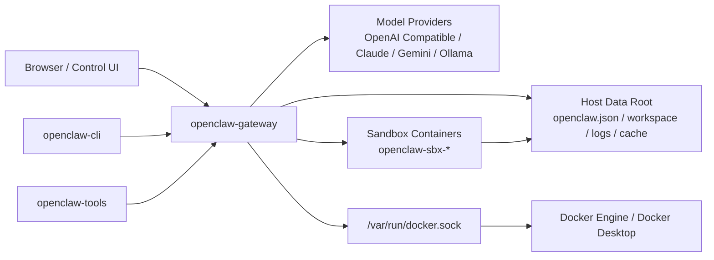

# OpenClaw Docker

一个面向本机 / 局域网部署的 `OpenClaw` Docker 增强方案，专注解决 **Docker sandbox、宿主机可编辑配置、多 agent 工作区隔离、OpenAI Compatible 接入** 等落地问题。

这个仓库不是 `OpenClaw` 核心源码仓库，而是一个围绕官方运行时镜像构建的 **部署与运维模板项目**。

## 为什么要用这个项目

相比直接运行官方镜像，这个项目额外处理了这些高频痛点：

- 支持 `OpenClaw` 的 Docker sandbox 落地
- 将 `openclaw.json` 直接持久化到宿主机，便于手改和排障
- 提供 `default`、`backend`、`frontend` 三个预置 agent
- 统一 `workspace`、`agentDir`、缓存、日志目录
- 支持 OpenAI Compatible 接口接入 `gpt-5.4` 等模型
- 预留 Anthropic、Gemini、Ollama、Feishu 配置模板
- 兼容 macOS Docker Desktop 下的 Docker socket 与文件共享限制

## 适用场景

适合：

- 本机部署 `OpenClaw`
- 局域网访问 OpenClaw Control UI
- 多 agent 协作工作流
- 需要 sandbox 执行命令的 AI agent 场景
- 想把配置、日志、缓存全部放在宿主机维护

不适合：

- 大规模生产集群
- Kubernetes 编排
- 高可用与多副本部署
- 面向公网的强安全生产发布场景

## 核心能力

- **Docker sandbox**：默认启用 `mode: "all"`、`scope: "agent"`
- **宿主机配置管理**：主配置文件保存在宿主机目录中
- **多 agent**：预置 `default`、`backend`、`frontend`
- **模型 provider 模板**：`default`、`claude`、`gemini`、`ollama`
- **运维辅助容器**：提供 `openclaw-cli` 和 `openclaw-tools`
- **Feishu 模板**：预置 channel 与 routing 结构

## 架构概览



更完整的设计说明见：`docs/open-source-manual.md`

## 目录结构

```text
.
├── Dockerfile
├── docker-compose.yml
├── .env.example
├── README.md
├── CHANGELOG.md
├── LICENSE
├── config/
│   └── openclaw.json.example
├── scripts/
│   ├── init-data-dir.sh
│   └── build-sandbox-image.sh
└── docs/
    └── open-source-manual.md
```

## 数据目录

宿主机数据根目录默认是：

```bash
/Users/awk/lqf/openclaw_data
```

初始化后主要包含：

- `openclaw/openclaw.json`
- `openclaw/workspace/agents/default`
- `openclaw/workspace/agents/backend`
- `openclaw/workspace/agents/frontend`
- `openclaw/workspace/sandbox`
- `openclaw/agents/<agent>/agent`
- `cache`
- `logs`

## 快速开始

先不要着急执行命令，先确认你的电脑已经准备好了 **Docker 环境**。

### 0. 先准备 Docker 环境

如果你是第一次接触这个项目，可以把它理解成：

- `OpenClaw` 是要运行的程序
- `Docker` 是用来装和运行这个程序的“容器工具”
- 没有 Docker，这个项目就跑不起来

如果你是 macOS 用户，推荐直接安装：

- `Docker Desktop`

安装完成后，请先打开 Docker Desktop，看到它正常启动，再继续下面的步骤。

你可以用下面两条命令检查 Docker 是否已经准备好：

```bash
docker --version
docker compose version
```

如果这两条命令都能正常输出版本号，就说明 Docker 环境已经准备好了。

如果你这一步就报错，先不要继续下面的部署步骤，先把 `Docker Desktop` 安装并启动成功。

如果你只想用**最短路径**把项目跑起来，直接执行下面这组命令：

```bash
cp .env.example .env
chmod +x bootstrap.sh
./bootstrap.sh
```

浏览器打开：

```text
http://localhost:18789
```

如果你更想按步骤理解整个部署过程，再继续看下面的分步说明。

`bootstrap.sh` 默认会：

- 检查 `.env` 是否存在
- 检查关键变量是否还是占位符
- 初始化宿主机数据目录
- 构建 sandbox 镜像
- 构建主镜像并启动 `openclaw-gateway`
- 输出访问地址和常用运维命令

### 1. 复制环境变量模板

现在开始真正操作，按顺序来：

**第一步：复制配置模板**

```bash
cp .env.example .env
```

请先理解这两个文件的区别：

- `.env.example`：仓库里的公开示例模板，可以提交到 GitHub
- `.env`：你本机的真实运行配置，**不能上传到 GitHub**

`.env.example` 现在已经提供了可直接参考的填写示例，但里面所有地址、token、API Key 都是示意值。
你应该基于它复制出自己的 `.env`，然后把真实值填进 `.env`，而不是反过来修改并提交 `.env`。

至少修改：

- `OPENCLAW_GATEWAY_TOKEN`
- `OPENAI_COMPATIBLE_BASE_URL`
- `OPENAI_COMPATIBLE_API_KEY`
- `OPENCLAW_RUN_USER`（如果你的本机 UID:GID 不是 `501:20`）

推荐填写方式：

- `OPENCLAW_GATEWAY_TOKEN`：填写你自己生成的长随机串
- `OPENAI_COMPATIBLE_BASE_URL`：填写你自己的 OpenAI Compatible 接口地址，例如 `http://your-openai-compatible-host:3000/v1`
- `OPENAI_COMPATIBLE_API_KEY`：填写你自己的真实 API Key

注意：

- 不要把你本机 `.env` 中的真实 IP、真实 token、真实 API Key 提交到仓库
- `.env.example` 只应该保留占位符或公开示例值

如果你已经填好这些值，可以直接执行：

```bash
chmod +x bootstrap.sh
./bootstrap.sh
```

如果你是完全第一次使用，可以把整个流程理解成下面这 8 步：

1. 安装并启动 `Docker` / `Docker Desktop`
2. 用 `docker --version` 和 `docker compose version` 检查 Docker 是否正常
3. 下载这个项目到本地
4. 执行 `cp .env.example .env`
5. 按 `.env.example` 的说明填写你自己的 `.env`
6. 执行 `chmod +x bootstrap.sh`
7. 执行 `./bootstrap.sh`
8. 打开浏览器访问 `http://localhost:18789`

### 2. 初始化宿主机数据目录

```bash
chmod +x scripts/init-data-dir.sh scripts/build-sandbox-image.sh
./scripts/init-data-dir.sh
```

### 3. 构建 sandbox 镜像

```bash
./scripts/build-sandbox-image.sh
```

### 4. 构建并启动服务

```bash
docker compose build
docker compose up -d openclaw-gateway
```

### 5. 查看状态

```bash
docker compose ps
docker compose logs -f openclaw-gateway
docker compose run --rm openclaw-cli gateway status
```

### 6. 打开控制台

```text
http://localhost:18789
```

## 服务说明

### `openclaw-gateway`

- 主服务
- 对外暴露 `18789` 和 `18790`
- 挂载宿主机配置、缓存、Docker socket 和宿主机数据根目录

### `openclaw-cli`

- 辅助 CLI 容器
- 共享 `openclaw-gateway` 网络命名空间
- 用于状态检查、pairing、日志相关命令

### `openclaw-tools`

- 可选调试容器
- 通过 `tools` profile 启动

```bash
docker compose --profile tools up -d openclaw-tools
docker compose exec openclaw-tools bash
```

## 为什么会看到两个容器

很多用户第一次启动后会看到：

- 一个主容器：`openclaw-gateway`
- 一个或多个运行时容器：`openclaw-sbx-*`

这**不是重复部署，也不是多起了无用容器**。

原因是：

- `openclaw-gateway` 负责网关、控制台、模型调度和 agent 生命周期管理
- `openclaw-sbx-*` 是 OpenClaw 在需要执行 sandbox 任务时，动态拉起的隔离容器

也就是说：

- **平时主服务只需要 `openclaw-gateway`**
- **当 agent 需要在 sandbox 中执行任务时，才会额外出现 `openclaw-sbx-*`**

这是当前项目设计的一部分，目的是把 agent 的命令执行与主服务隔离开，降低直接在主容器中执行任务的风险。

如果你看到 2 个容器，通常说明：

- 主服务已经启动成功
- sandbox 也正在正常工作

这属于**符合预期的行为**，不是故障。

## 配置说明

### 主配置文件

请直接编辑：

```bash
/Users/awk/lqf/openclaw_data/openclaw/openclaw.json
```

### 预置 agent

- `default`：通用助手
- `backend`：后端开发助手
- `frontend`：前端 / UI 助手

### Provider 模板

`config/openclaw.json.example` 中预留了：

- `default`
- `claude`
- `gemini`
- `ollama`

默认模型引用：

```json
"default/gpt-5.4"
```

## 常用命令

```bash
# 查看服务状态
docker compose ps

# 查看网关日志
docker compose logs -f openclaw-gateway

# 查看网关运行状态
docker compose run --rm openclaw-cli gateway status

# 启动调试容器
docker compose --profile tools up -d openclaw-tools

# 进入调试容器
docker compose exec openclaw-tools bash
```

## 常见问题

### 1. Docker socket 权限报错

如果看到：

```text
permission denied while trying to connect to the docker API
```

说明容器内访问 Docker socket 的权限有问题。本项目已经通过 `group_add: ["0"]` 处理这一点。

### 2. Docker Desktop 文件共享报错

如果看到：

```text
mounts denied: path is not shared from the host
```

说明 sandbox 正在尝试挂载 Docker Desktop 未认可的路径。本项目当前通过宿主机绝对路径 `workspace` / `workspaceRoot` 方案处理了这个问题。

### 3. 页面显示 `pairing required`

说明当前浏览器设备还没有完成配对。这是首次接入时的正常安全流程。

## 文档索引

- 综合手册：`docs/open-source-manual.md`
- 设计 / 运维实施记录：`docs/plans/2026-04-08-openclaw-docker-compose.md`
- 变更记录：`CHANGELOG.md`

## 开源建议

在公开仓库前，请确认：

- 不提交真实 `.env`
- 不提交真实 API Key / Gateway Token / Feishu Secret
- `.env.example` 中只保留公开示例，不保留真实 IP、真实 token、真实 key
- 如有泄漏历史，先轮换密钥再发布

## 路线图

后续可以继续补充：

- `docs/architecture.md`
- `docs/operations.md`
- `docs/faq.md`
- GitHub Actions 基础校验
- `SECURITY.md`
- 更完善的 Linux 部署说明

## 致谢

- 官方站点：`https://openclaw.ai/`
- 官方 Docker 文档：`https://docs.openclaw.ai/install/docker`
- 官方 Sandboxing 文档：`https://docs.openclaw.ai/gateway/sandboxing`
- 飞书通道文档：`https://docs.openclaw.ai/channels/feishu`
- Channel routing 文档：`https://docs.openclaw.ai/channels/channel-routing`


## License

本仓库当前采用 `MIT` 协议，详见 `LICENSE`。
